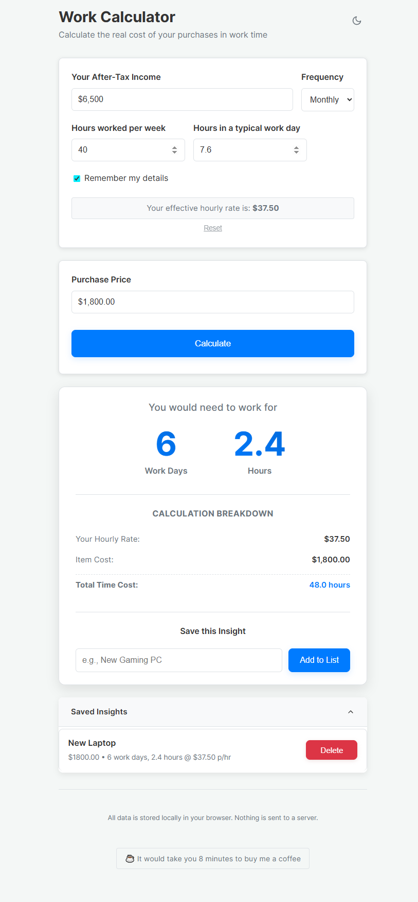

# Work Calculator

A modern, client-side application that helps you understand the true cost of purchases in terms of your working time. Built with React and Vite.



## ✨ Features

- 💰 Calculate how much working time a purchase will cost you
- 📊 Understand your effective hourly rate after taxes
- 💾 Save and compare multiple items
- 🌓 Light and dark mode support
- 📱 Fully responsive design
- 🔒 100% client-side - your data stays on your device

## 🚀 Getting Started

### Prerequisites

- Node.js (v18 or later)
- npm or yarn

### Installation

1. Clone the repository
   ```bash
   git clone https://github.com/charltona/workcalculator.git
   cd workcalculator
   ```

2. Install dependencies
   ```bash
   npm install
   # or
   yarn
   ```

3. Start the development server
   ```bash
   npm run dev
   # or
   yarn dev
   ```

4. Open [http://localhost:5173](http://localhost:5173) in your browser

## 🛠️ Building for Production

To create a production build:

```bash
npm run build
# or
yarn build
```

The build artifacts will be stored in the `dist/` directory.

## 🤝 Contributing

Contributions are welcome! Please feel free to submit a Pull Request.

## 📝 License

This project is open source and available under the [MIT License](LICENSE).

## ☕ Support

If you find this project useful, consider buying me a coffee!

[](https://www.buymeacoffee.com/aaronc.au)

## 📄 Project Structure

```
src/
├── components/      # Reusable UI components
├── contexts/       # React context providers
├── utils/          # Utility functions and calculations
├── App.jsx         # Main application component
└── main.jsx        # Application entry point
```

## 🧪 Testing

Run the test suite with:

```bash
npm test
# or
yarn test
```

## 📱 Browser Support

The application is tested on the latest versions of:
- Chrome
- Firefox
- Safari
- Edge
